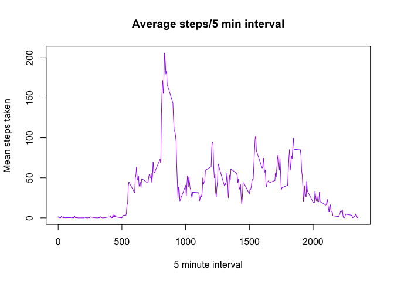
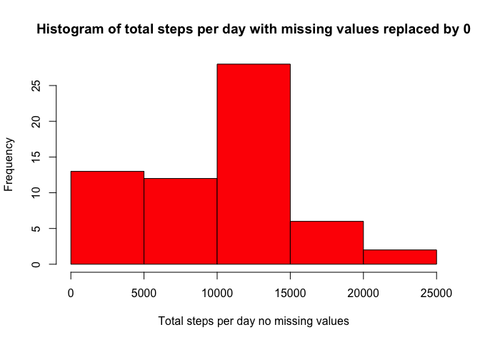
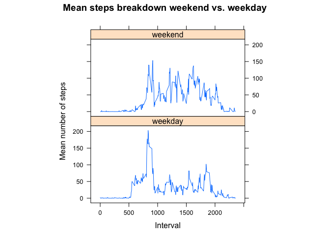

# Reproducible Research: Peer Assessment 1


## Loading and preprocessing the data
Make sure you install the following packages:

- knitr
- rmarkdown
- lattice
- plyr

Let's read in the file and convert the date column to an actual date type.


```r
library (plyr)
library (lattice)
library (knitr)
library (rmarkdown)

activity <- read.csv("activity.csv")
activity$date <- as.Date(activity$date, "%Y-%m-%d")
head(activity)
```

```
##   steps       date interval
## 1    NA 2012-10-01        0
## 2    NA 2012-10-01        5
## 3    NA 2012-10-01       10
## 4    NA 2012-10-01       15
## 5    NA 2012-10-01       20
## 6    NA 2012-10-01       25
```
We've got N/As but we'll deal with them later. 

We should be ready for some analysis now. 

## What is mean total number of steps taken per day?

First we will calcualte the total number of steps taken per day and generate a histogram. 


```r
stepsperday <- ddply(activity, .(date), summarize, total = sum(steps, na.rm=TRUE))
hist(stepsperday$total, col="red", xlab = "Total steps per day", main="Histogram of total steps per day")
```

 

```r
meanperday <- sprintf ("%.2f", mean(stepsperday$total, na.rm=TRUE))
medianperday <- median(stepsperday$total, na.rm=TRUE)
```

The mean number of steps/day was 9354.23.
The median number of steps/day was 10395.

## What is the average daily activity pattern?

First aggregate things by 5 minute interval. Then generate the line chart.


```r
stepsper5min <- ddply(activity, .(interval), summarize, mean = mean(steps, na.rm=TRUE))
plot ( stepsper5min, type="l", col="purple", main="Average steps/5 min interval", xlab="5 minute interval", ylab="Mean steps taken")
```

 

```r
topsteps <- head(stepsper5min[order(stepsper5min$mean, decreasing=TRUE),], 1)
```

Interval 835 contains the maximum average number of steps 206.

## Inputing missing values

There are a total of 2304 missing values in the dataset. How should be add them back in? The suggestion from the assignment is to just plug in the mean or median for the day, but I'm not sure that is reasonable. The other suggestion is to sub the median for that time period, but isn't at all obvious to me that someone will typically walk the same amount every day regardless of the day. One could do a comparison of approaches to see what the affect would be, but that's not the intent of this assigned. So I will take a naive appraoch and just replace N/As with 0. 

Now we'll repeat the analysis from above. New histogram and new mean and median calculations. 


```r
missing<-sum(is.na(activity$steps))
activitynona <- activity
activitynona[is.na(activitynona)] <- 0
stepsperdaynona <- ddply(activity, .(date), summarize, total = sum(steps, na.rm=TRUE))
hist(stepsperdaynona$total, col="red", xlab = "Total steps per day no missing values", main="Histogram of total steps per day with missing values replaced by 0")
```

 

```r
meanperdaynona <- sprintf ("%.2f", mean(stepsperdaynona$total, na.rm=TRUE))
medianperdaynona <- median(stepsperdaynona$total, na.rm=TRUE)
```

When the missing values are replaced by 0s:
The mean number of steps/day was 9354.23.
The median number of steps/day was 10395.

We can conclude from this that replacing the N/As with 0 is the same as just ignoring them. 

## Are there differences in activity patterns between weekdays and weekends?


```r
activitynona$weekend <- as.factor(ifelse( weekdays (activity$date) %in% c("Sunday", "Saturday"), "weekend", "weekday"))
stepsper5minweekend <- ddply(activitynona, .(interval, weekend), summarize, mean = mean(steps, na.rm=TRUE))
xyplot (mean ~ interval | factor (weekend), data = stepsper5minweekend, aspect = 1/2, type = "l", ylab="Mean number of steps", xlab = "Interval", main="Mean steps breakdown weekend vs. weekday")
```

 

